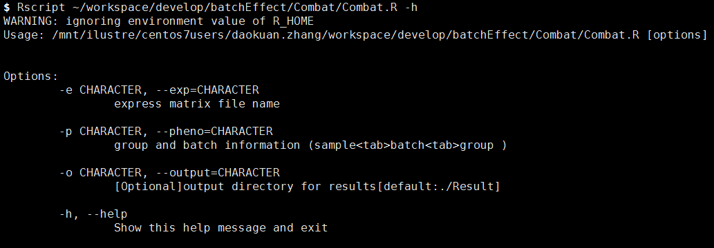
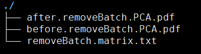

# Combat 进行批次矫正


# 一. 目的：


### 对存在批次的批次的表达谱按样本进行去批次矫正


# 二. 使用示例：

### 程序执行：  `
```r
 Rscript /mnt/ilustre/centos7users/daokuan.zhang/workspace/develop/batchEffect/Combat/Combat.R -e unigene.tpm.matrix.xls -p batch_info.txt -o ./  
```
### 例子路径



```r
- 参数说明：  
 -e  表达量矩阵文件  
 -p  样本分组文件，表头为sample <tab >batch <tab>group  
 -o  结果输出路径，默认为当前路径下Result目录内
```

# 三. 结果展示:  
- 输出的目录结果包含以下三个文件：  
 `removeBatch.matrix.txt:` 去批次矫正后的表达矩阵结果  
`before.removeBatch.PCA.pdf:` 原始表达矩阵PCA 批次信息展示图  
`after.removeBatch.PCA.pdf:`  去批次后表达矩阵PCA 批次信息展示图  




# 参考文献

1. W. Evan Johnson, Cheng Li, Ariel Rabinovic, [Adjusting batch effects in microarray expression data using empirical Bayes methods](https://doi.org/10.1093/biostatistics/kxj037), Biostatistics, Volume 8, Issue 1, January 2007, Pages 118–127.
2. Yuqing Zhang, Giovanni Parmigiani, W Evan Johnson, [ComBat-seq: batch effect adjustment for RNA-seq count data, NAR Genomics and Bioinformatics](https://doi.org/10.1093/nargab/lqaa078), Volume 2, Issue 3, September 2020, lqaa078.
