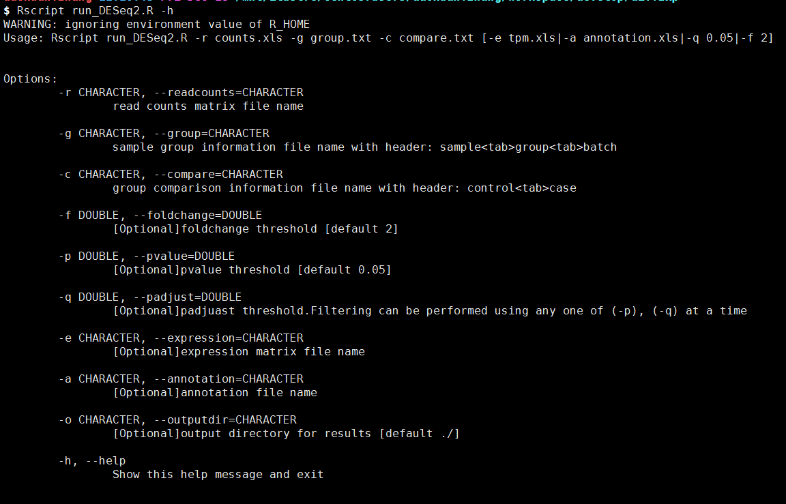
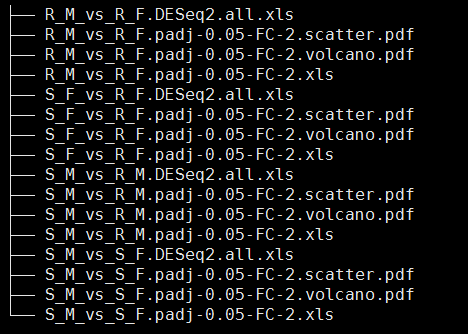

# DESeq2差异分析


# 一. 目的：


### 使用DEseq2 对RNAseq的表达谱数据进行差异分析


# 二. 使用示例：

### 程序执行：  
```r
 Rscript /mnt/ilustre/centos7users/daokuan.zhang/workspace/develop/diffExp/run_DESeq2.R -r miRNA.counts.txt -g group.txt -c compare.txt -e miRNA_tpm.xls -a miRNA.target.anno.txt
```
### 例子路径



```r
- 参数说明：
 必须参数：
 -r 原始定量的 read counts文件
 -g 样本分组文件，包含样本名，组名。根据样本的批次信息列可选填，以进行去批次矫正的差异分析。
 -c 差异分组文件，第一列为比较组，第二列为实验组，多个比较组数会并行运算。 
 可选参数：
 -f 差异筛选的差异倍数阈值，默认为2
 -p 原始pvalue阈值，进行差异筛选,默认使用该选项阈值为0.05
 -q 矫正的padjust阈值，进行差异筛选
 -e 序列表达谱文件，用于添加到差异分析结果
 -a 序列描述信息文件，用于添加到差异分析结果
 -o 结果文件输出目录，默认为当前路径。
```

# 三. 结果展示:  
- 输出的目录结果包含以下三个文件：  
 **vs_*.DESeq2.all.xls：所有序列的 差异分析结果详情
*_vs_.padjust-0.05-FC-2.xls： 按阈值筛选的差异表达的序列结果详情

​        *_vs_.padjust-0.05-FC-2.scatter.pdf： 差异分析结果的散点图

​        *_vs_.padjust-0.05-FC-2.volcano.pdf： 差异分析结果的火山图




# 参考文献

1.   Love, M.I., Huber, W. & Anders, S. [Moderated estimation of fold change and dispersion for RNA-seq data with DESeq2](https://doi.org/10.1186/s13059-014-0550-8). *Genome Biol* **15,** 550 (2014). 
