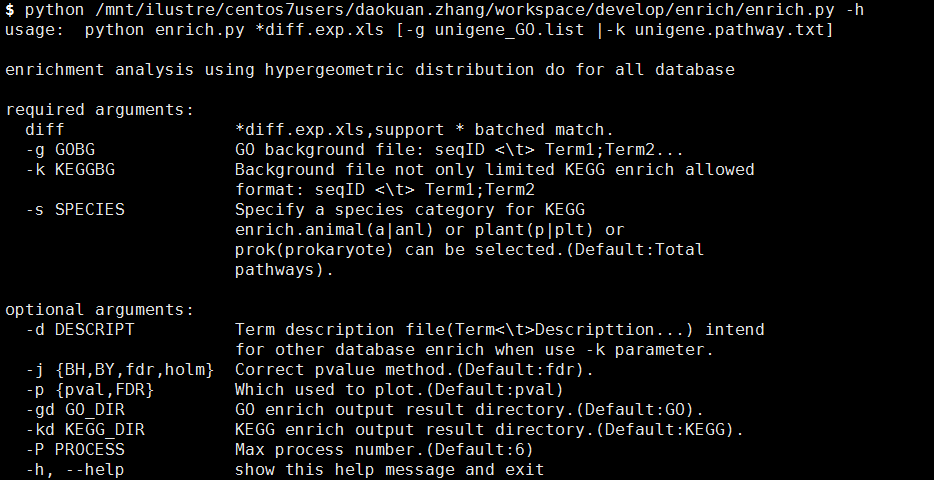
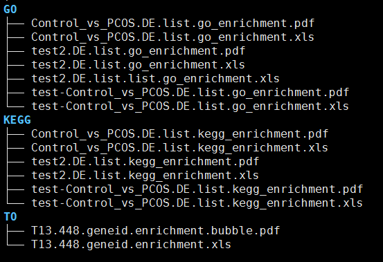

# 富集分析


# 一. 目的：


### 对目标基因集进行功能富集分析。采用软件 Goatools 进行GO富集分析； 用python脚本进行KEGG PATHWAY 或其他数据库的富集分析 ，原理为超几何分布检验。


# 二. 使用示例：

### 程序执行：  `
```r
 python /mnt/ilustre/centos7users/daokuan.zhang/workspace/develop/enrich/enrich.py *DE.list -g unigene_GO.list -k unigene_pathway.txt -s anl
```
### 例子路径



```r
- 参数说明：
 diff 位置参数，基因集文件，支持一次输入多个文件(空格分隔或者*通配符匹配)
 -g GO数据库的注释背景文件，第一列为序列名，第二列为GO ID;多个以;分隔
 -k KEGG数据库背景文件。第一列为序列名，第二列包含kegg K ID。支持其他数据库的背景文件使用该参数富集分析，格     式同-g 参数要求 
 -s KEGG富集分析需要指定的通路（pathway)物种类别，可指定动物/植物/原核,默认使用所有物种。
 -d 对除GO/KEGG 之外的其他数据库富集分析结果时，需要添加条目描述信息的文件，第一列为功能数据库条目，其他列为     条目的描述信息
 -j 富集显著性pvalue值的矫正方法，默认方式使用FDR
 -p 选择富集结果绘图以原始pvalue值展示，还是经过矫正的padjust值展示
 -gd GO富集结果存放目录，默认创建并存放GO目录下
 -kd KEGG（或其他数据库），默认创建并存放KEGG目录下
 -P 最大进程数，支持多个基因集文件同时运行的最大并行数，默认为6.
```

# 三. 结果展示:  
- 输出的目录结果包含以下三个文件：  
 *enrichment.xls:` 富集结果详情文件。  
*enrichment.pdf： 富集结果中显著性条目展示图`




# 参考文献

1.  Klopfenstein, D.V., Zhang, L., Pedersen, B.S. *et al.* [GOATOOLS: A Python library for Gene Ontology analyses](https://doi.org/10.1038/s41598-018-28948-z ). *Sci Rep* **8,** 10872 (2018). 
2.  Kotlyar VV, Skidanov RV, Khonina SN, Soifer VA. [Hypergeometric modes](https://pubmed.ncbi.nlm.nih.gov/17339921/). Opt Lett. 2007 Apr 1;32(7):742-4. doi: 10.1364/ol.32.000742. PMID: 17339921. 
3.  Reimand, J., Isserlin, R., Voisin, V. et al. [Pathway enrichment analysis and visualization of omics data using g:Profiler, GSEA, Cytoscape and EnrichmentMap]( https://doi.org/10.1038/s41596-018-0103-9
). Nat Protoc 14, 482–517 (2019).

