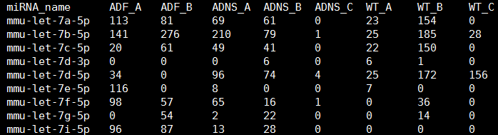
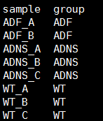
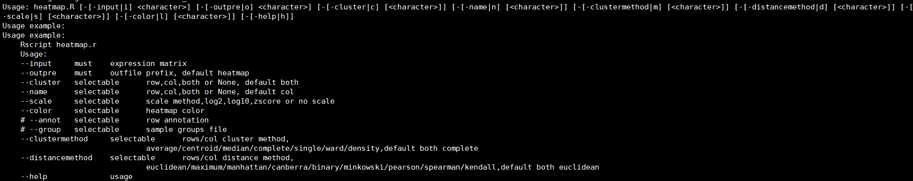
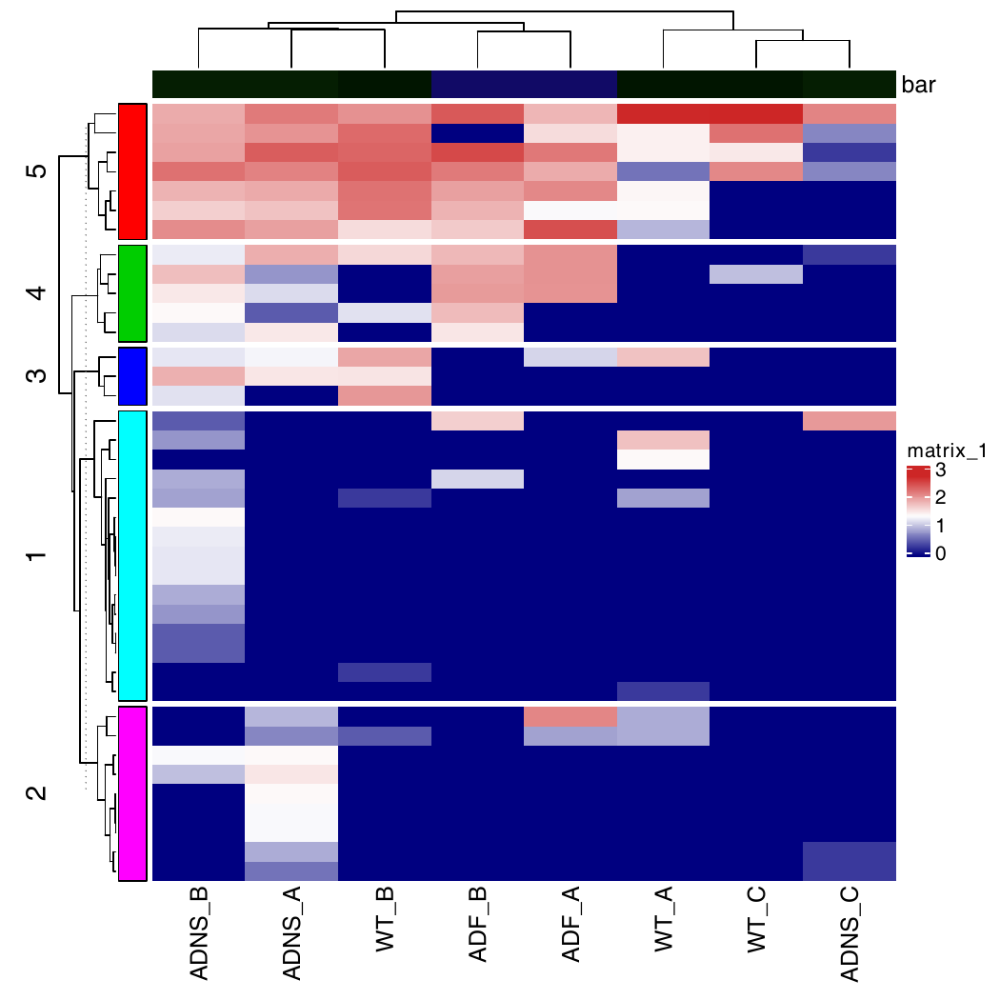

# 热图制作


# Heatmap 

脚本所用软件包为：[Complex Heatmap](https://jokergoo.github.io/ComplexHeatmap-reference/book/index.html)

# 一. 数据准备 

数据矩阵：



分组文件：



# 二. 使用说明 

脚本路径：`/mnt/ilustre/centos7users/xiaolong.he/develop/plot/heatmap/heatmap.R`

# 用法示例：
```r
export R_LIBS=;export R_HOME=;export RHOME=;/mnt/ilustre/centos7users/dna/.env/R-3.6.1/bin/Rscript heatmap.R -i /mnt/ilustre/centos7users/xiaolong.he/develop/plot/data/heatmap.data.txt -g /mnt/ilustre/centos7users/xiaolong.he/develop/plot/data/group.txt -a 5 -c both -n col -s log10 -l blue,white,red -m complete,complete -d euclidean,euclidean -o test
```



### 参数详情 ###
```r
--input	must	expression matrix # 输入文件，表达量矩阵
--outpre	must	outfile prefix, default heatmap # 输出文件前缀
--cluster	selectable	row,col,both or None, default both # 是否行列聚类
--name	selectable	row,col,both or None, default col # 是否显示行列名
--scale	selectable	scale method,log2,log10,zscore or no scale # 是否进行数据标准化，默认不做处理
--color	selectable	heatmap color # 热图颜色
--annot	selectable	row annotation # 列注释，按所给数值进行划分聚类结果，进行行注释
--group	selectable	sample groups file # 分组文件，热图列注释按分组文件进行
# 聚类方式，默认complete
--clustermethod	selectable	rows/col cluster method,average/centroid/median/complete/single/ward/density,default both complete
# 聚类距离，默认euclidean
--distancemethod	selectable	rows/col distance method, euclidean/maximum/manhattan/canberra/binary/minkowski/pearson/spearman/kendall,default both euclidean
--help		usage
```

## 代码 ##
```r
1 #!/usr/bin/env Rscript3.6
2 
3 suppressMessages(library("getopt"))
4 options(bitmapType='cairo')
5 spec = matrix(c(
6     'input','i',1,'character',
7     'outpre','o',1,'character',
8     'cluster','c',2,'character',
9     'name','n',2,'character',
10     'clustermethod','m',2,'character',
11     'rot','r',2,'numeric',
12     'distancemethod','d',2,'character',
13     'scale','s',2,'character',
14     'annot','a',2,'numeric',
15     'group','g',2,'character',
16     'color','l',2,'character',
17     'help','h',0,'logical'
18     ), byrow=TRUE, ncol=4);
19 opt = getopt(spec);
20 print_usage <- function(spec=NULL){
21   cat("\n*************  R 3.6.1  *************\n\n")
22   cat(getopt(spec, usage=TRUE));
23   cat("Usage example: \n");
24   cat("
25     Rscript heatmap.r
26     Usage:
27     --input     must    expression matrix
28     --outpre    must    outfile prefix, default heatmap
29     --cluster   selectable      row,col,both or None, default both
30     --name      selectable      row,col,both or None, default col
31     --scale     selectable      scale method,log2,log10,zscore orno scale
32     --color     selectable      heatmap color
33     --annot     selectable      row annotation
34     --group     selectable      sample groups file
35     --rot       selectable      rot of row labels
36     --clustermethod     selectable      rows/col cluster method,
37                                 average/centroid/median/completesingle/ward/density,default both complete
38     --distancemethod    selectable      rows/col distance method, 
39                                 euclidean/maximum/manhattancanberra/binary/minkowski/pearson/spearman/kendall,default botheuclidean
40     --help              usage\n"
41     );
42   q(status=1);
43 }
44 
45 
46 if ( !is.null(opt$help)) {print_usage(spec)}
47 if ( is.null(opt$input)){print_usage(spec)}
48 if ( is.null(opt$outpre)){print_usage(spec)}
49 if ( is.null(opt$cluster)){opt$cluster = 'both'}
50 if ( is.null(opt$name)){opt$name = 'col'}
51 if ( is.null(opt$rot)){opt$rot = 90}
52 
53 ## 1.scale  2.cluster 3. annot 4.color 
54 
55 # load packages
56 .libPaths("/mnt/ilustre/centos7users/xiaolong.he/Rx86_64-pc-linux-gnu-library/3.6/")
57 suppressMessages(c(library(circlize),library(ComplexHeatmap)))
58 
59 # load expression matrix
60 dat <- as.matrix(read.table(opt$input,header=T,row.names=1sep='\t',stringsAsFactors=F))
61 
62 # scale
63 if(!is.null(opt$scale)){
64   if(opt$scale == 'log2'){
65     dat <- log2(dat+1)
66   }else if(opt$scale == 'log10'){
67     dat <- log10(dat+1)
68   }else if(opt$scale == 'zscore'){
69     dat <- scale(dat)
70   }
71 }
72 
73 # cluster
74 if(opt$cluster == 'both'){
75   cluster_rows = TRUE; cluster_columns = TRUE
76 }else if(opt$cluster == 'col'){
77   cluster_rows = FALSE;cluster_columns = TRUE
78 }else if(opt$cluster == 'row'){
79   cluster_rows = TRUE; cluster_columns = FALSE
80 }else if(opt$cluster == 'None'){
81   cluster_rows = FALSE; cluster_columns = FALSE
82 }
83 
84 # row/col names
85 if(opt$name == 'both'){
86   row_names = TRUE;columns_names = TRUE;
87 }else if(opt$name == 'col'){
88   row_names = FALSE;columns_names = TRUE;
89 }else if(opt$name == 'row'){
90   row_names = TRUE;columns_names = FALSE;
91 }else if(opt$name == 'None'){
92   row_names = FALSE;columns_names = FALSE;
93 }
94 
95 # cluster method
96 if(is.null(opt$clustermethod)){
97   Clustering <- c('complete','complete')
98 }else{
99   Clustering = strsplit(opt$clustermethod, ',')[[1]]
100 }
101 
102 # distance method
103 if(is.null(opt$distancemethod)){
104   distance = c('euclidean', 'euclidean')
105 }else{
106   distance = strsplit(opt$distancemethod, ',')[[1]]
107 }
108 
109 # color
110 if(is.null(opt$color)){
111   color <- colorRampPalette(c("navy", "white", "firebrick3"))(50)
112 }else{
113   #a <- as.character(strsplit(opt$color, ','));print(a):prin(typeof(a))
114   color <- colorRampPalette(as.vector(strsplit(opt$color, ','))[1]])(50)
115 }
116 
117 # annot: unused argument( left_annotation), unsolved
118 if(!is.null(opt$annot)){
119   row_anno <- rowAnnotation(foo = anno_block(gp = gpar(fill = 2(opt$annot+1)),
120     labels_gp = gpar(col = "white", fontsize = 10)))
121 }
122 
123 if(!is.null(opt$group)){
124   group <- read.table(opt$group,header=T,row.names=1,sep='\t'stringsAsFactors=F)
125   # print(group)
126   cols_anno <- HeatmapAnnotation(group = group[,1],show_legend=F)
127 }
128 
129 pdf(paste(opt$outpre,'pdf',sep='.'))
130 if(exists("cols_anno")){
131   if(exists("row_anno")){
132   Heatmap(dat, col = color, cluster_rows = cluster_rows,cluster_columns = cluster_columns,
133   clustering_method_rows = Clustering[1],clustering_method_columns = Clustering[2],
134   clustering_distance_rows = distance[1],clustering_distance_columns = distance[2],
135   show_row_names = row_names,show_column_names = columns_names,top_annotation = cols_anno,
136   left_annotation = row_anno,row_km = opt$annot,column_names_rot= opt$rot)
137   }else{
138   Heatmap(dat, col = color, cluster_rows = cluster_rows,cluster_columns = cluster_columns,
139   clustering_method_rows = Clustering[1],clustering_method_columns = Clustering[2],
140   clustering_distance_rows = distance[1],clustering_distance_columns = distance[2],
141   show_row_names = row_names,show_column_names = columns_names,top_annotation = cols_anno,
142   column_names_rot = opt$rot)
143   }
144 }else{
145   if(exists("row_anno")){
146   Heatmap(dat, col = color, cluster_rows = cluster_rows,cluster_columns = cluster_columns,
147   clustering_method_rows = Clustering[1],clustering_method_columns = Clustering[2],
148   clustering_distance_rows = distance[1],clustering_distance_columns = distance[2],
149   show_row_names = row_names,show_column_names = columns_names, 
150   left_annotation = row_anno,row_km = opt$annot,column_names_rot= opt$rot)
151   }else{
152   Heatmap(dat, col = color, cluster_rows = cluster_rows,cluster_columns = cluster_columns,
153   clustering_method_rows = Clustering[1],clustering_method_columns = Clustering[2],
154   clustering_distance_rows = distance[1],clustering_distance_columns = distance[2],
155   show_row_names = row_names,show_column_names = columns_namescolumn_names_rot = opt$rot)
156   }
157 }
158 dev.off()
159 q()
```


## 结果展示 ##


# 注意： #

由于ComplexHeatmap版本问题，此脚本运行需在R3.6及以上版本运行，集群默认版本运行会报错。

# 参考文献

Gu Z, Eils R, Schlesner M (2016). [Complex heatmaps reveal patterns and correlations in multidimensional genomic data](https://academic.oup.com/bioinformatics/article-abstract/32/18/2847/1743594). Bioinformatics.
