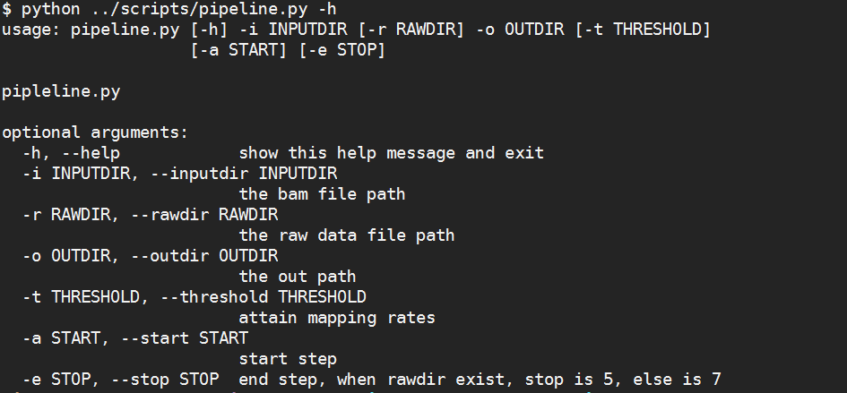
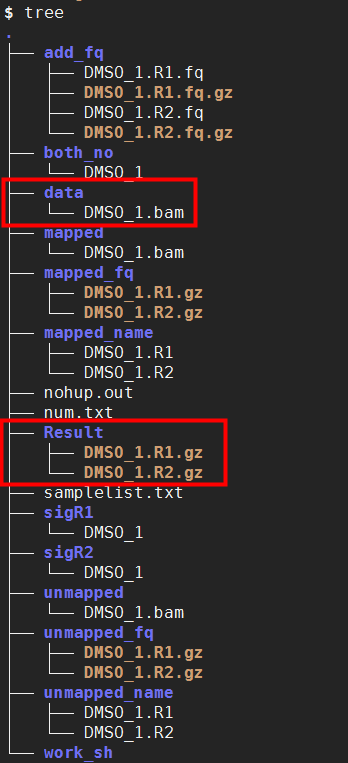

# 根据比对率生产假的原始序列数据


# Mapping #

## 一. 数据准备 ##
比对的到的bam文件：DMSO_1.bam

## 二. 使用说明 ##
```python
脚本路径：
/mnt/ilustre/centos7users/xiaolong.he/develop/after_sales/mapping/scripts/pipeline.py

用法示例：nohup python ../scripts/pipeline.py -i data/ -o ./ -a 1 -e 7 -t 0.8 &

示例路径：
/mnt/ilustre/centos7users/xiaolong.he/develop/after_sales/mapping/demo
```




### 参数详情 ###
```python
usage: pipeline.py [-h] -i INPUTDIR [-r RAWDIR] -o OUTDIR [-t THRESHOLD]
                   [-a START] [-e STOP]

pipleline.py

optional arguments:
  -h, --help            show this help message and exit
  -i INPUTDIR, --inputdir INPUTDIR
                        the bam file path    # bam 文件路径
  -r RAWDIR, --rawdir RAWDIR
                        the raw data file path    # 提取raw时，raw文件路径
  -o OUTDIR, --outdir OUTDIR
                        the out path    # 输出结果储存路径
  -t THRESHOLD, --threshold THRESHOLD
                        attain mapping rates    # 处理后要到达的比对率
  -a START, --start START
                        start step    # 起始步骤，默认1
  -e STOP, --stop STOP  end step, when rawdir exist, stop is 5, else is 7       # 结束步骤，提起raw data 时默认5， clean data 默认7
```

## 三. Pipeline代码 ##

```python
#!/usr/bin/env python
# -*-coding:utf-8-*-

#!/usr/bin/env python
# -*-coding:utf-8-*-

import os
import argparse
import subprocess

parser = argparse.ArgumentParser(description="pipleline.py")
parser.add_argument('-i', '--inputdir', required=True, help='the bam file path')
parser.add_argument('-r', '--rawdir', default="False", help='the raw data file path')
parser.add_argument('-o', '--outdir', required=True, help='the out path')
parser.add_argument('-t', '--threshold', type=float, help='attain mapping rates', default = 0.8)
parser.add_argument('-a', '--start', type=int, help='start step', default = 1)
parser.add_argument('-e', '--stop', required=False, type=int, help='end step, when rawdir exist, stop is 5, else is 7')
args = parser.parse_args()

if __name__ == '__main__':
    inpath = os.path.abspath(args.inputdir)
    outpath = os.path.abspath(args.outdir)

    scpath = os.path.abspath(os.path.dirname(__file__))
    
    if os.path.exists('work_sh'):
        pass
    else:
        os.mkdir('work_sh')
    pipe_sh = outpath+'/work_sh/pipe_test.sh'
    sh = []
    sh.append("python3 %s -i %s -o %s && "%(scpath+'/bin/'+'01.bam_map_unmap.py', inpath, outpath))
    sh.append("python3 %s -i %s && "%(scpath+'/bin/'+'02.bam2fq.py',outpath))
    sh.append("python3 %s -i %s && "%(scpath+'/bin/'+'03.get_ids.py',outpath))
    # print(args.stop)
    if args.rawdir == "False":
        if args.stop == None:
            args.stop = 7
        sh.append("python3 %s -i %s && "%(scpath+'/bin/'+'04.both_no_map_name.py', outpath))
        sh.append("python3 %s -i %s -t %s && "%(scpath+'/bin/'+'05.sig_map_name.py', outpath, str(args.threshold)))
        sh.append("python3 %s -i %s && "%(scpath+'/bin/'+'06.getseq.py', outpath))
        sh.append("python3 %s -i %s"%(scpath+'/bin/'+'07.combine.py', outpath))
    else:
        if args.stop == None:
            args.stop = 5
        sh.append("python3 %s -i %s && "%(scpath+'/bin/'+'04.get_names.py', outpath))
        rawpath = os.path.abspath(args.rawdir)
        sh.append("python3 %s -i %s -r %s "%(scpath+'/bin/'+'05.get_raw_seq.py', outpath, rawpath))
    f = open(pipe_sh, 'w')
    for i in range(args.start,args.stop+1):
        f.writelines(sh[i-1])
    f.close()
    subprocess.Popen(["qsub-slurm.pl", "--Resource", "mem=10G", "--CPU", "1", pipe_sh])
```

## 四. 结果展示 ##
1. data：为提供的准备数据

2. Result：经处理后得到的数据



