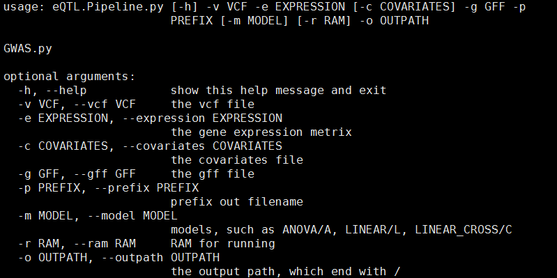
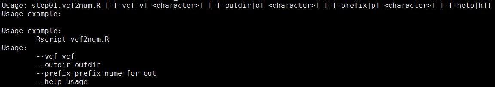
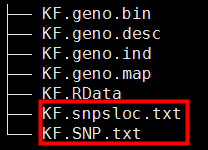
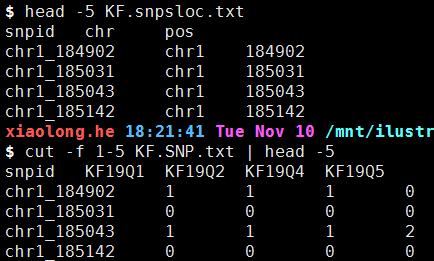
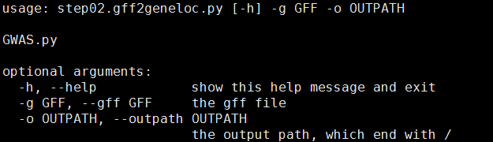
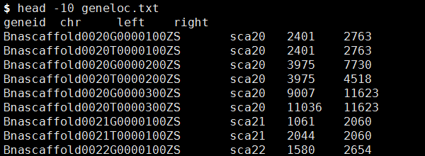
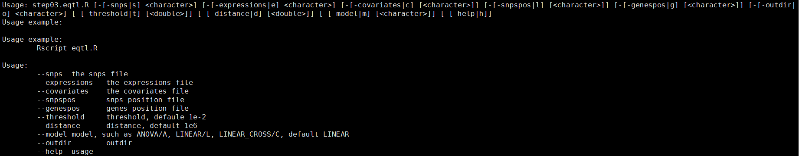
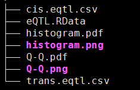
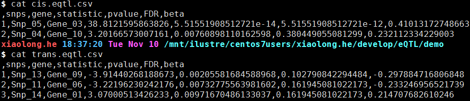

# TWAS/eQTL analysis pipeline


# eQTL #
## 数据准备 ##

1. 物种的gff文件
2. vcf文件（已做完基因型填充）

```shell
$java -jar /mnt/ilustre/centos7users/xiaolong.he/bin/beagle/beagle.18May20.d20.jar gt=/mnt/ilustre/centos7users/xiaolong.he/others/GWAS_mengluo/KF/pop.uniq.vcf out=/mnt/ilustre/centos7users/xiaolong.he/others/GWAS_mengluo/KF/pop.phased>
```

1. 基因表达量矩阵（行为基因，列为样本）

## Pipeline ##

示例：



```python
python eQTL.Pipeline.py -e expression.xls -c covariates -g ref.gff -p test -r 50 -o ./>
其中`-c`参数为可选参数
#!/usr/bin/env python
# -*-coding:utf-8-*-

import os
import argparse
import subprocess
import time

start = time.time()
parser = argparse.ArgumentParser(description="GWAS.py")
parser.add_argument('-v', '--vcf', required=True, help='the vcf file')
parser.add_argument('-e', '--expression', required=True, help='the gene expression metrix')
parser.add_argument('-c', '--covariates', help='the covariates file', default = 'None')
parser.add_argument('-g', '--gff', required=True, help='the gff file')
parser.add_argument('-p', '--prefix', required=True,help='prefix out filename')
parser.add_argument('-m', '--model', help='models, such as ANOVA/A, LINEAR/L, LINEAR_CROSS/C', default = 'L')
parser.add_argument('-r', '--ram', help='RAM for running', default = 20)
parser.add_argument('-o', '--outpath', required=True, help='the output path, which end with /')
args = parser.parse_args()

def data_prepare():
    out = os.path.abspath(args.outpath)
    vcf = os.path.abspath(args.vcf)
    gff = os.path.abspath(args.gff)
    os.chdir(out)
    if os.path.exists('work_sh'):
        pass
    else:
        os.mkdir('work_sh')
    scpath = os.path.abspath(os.path.dirname(__file__))
    f = open("work_sh/eqtl.sh", "w")
    step1 = scpath+'/step01.vcf2num.R'
    f.writelines("cd " + out + " && ")
    f.writelines("Rscript " + step1 + " -v " + vcf + " -o " + out + " -p " + args.prefix + " & ")
    # f2 = open("work_sh/step02.gff2geneloc.sh", "w")
    step2 = scpath+'/step02.gff2geneloc.py'
    f.writelines("python " + step2 + " -g " + gff + " -o " + out + ' && ')
    # f3 = open("work_sh/step03.eqtl.sh", "w")
    step3 = scpath+'/step03.eqtl.R'
    if args.covariates != "None":
        f.writelines("export R_LIBS=;export R_HOME=;export RHOME=;/mnt/ilustre/centos7users/dna/.env/R-3.6.1/bin/Rscript "+ step3 \
                + " -s " + out + args.prefix + ".SNP.txt" + " -e " + args.expression + " -c " + args.covariates + " -l " + out + \
                args.prefix + ".snpsloc.txt" + " -g "+ "geneloc.txt" + " -o " + args.outpath)
    else:
        f.writelines("export R_LIBS=;export R_HOME=;export RHOME=;/mnt/ilustre/centos7users/dna/.env/R-3.6.1/bin/Rscript " + step3 \
                + " -s " + out + args.prefix + ".SNP.txt" + " -e " + args.expression + " -l " + out + args.prefix + ".snpsloc.txt" \
                + " -g "+ "geneloc.txt" + " -m " + args.model + " -o " + out)
    f.close()
    os.chdir("work_sh")
    subprocess.Popen(["qsub-slurm.pl", "--Resource", "mem="+args.ram, "--CPU", "2", "eqtl.sh"])

if __name__ == '__main__':
    data_prepare()
    end = time.time()
    print('Running time: %s Seconds'%(end-start))
```

## setp1 data prepare ##
从vcf文件提取snp位置信息，以及snp基因型矩阵



```r
#/usr/bin/env Rscript
.libPaths(c("/mnt/ilustre/centos7users/meng.luo/.env/lib/R/library/","/mnt/ilustre/centos7users/xiaolong.he/lib/R3.5/"))

library('getopt')
options(bitmapType='cairo')
spec = matrix(c(
		'vcf','v',1,'character',
		'outdir','o',1,'character',
		'prefix','p',1,'character',
		'help','h',0,'logical'
		),byrow=TRUE, ncol=4);
opt = getopt(spec)
print_usage <- function(spec=NULL){
	cat(getopt(spec, usage=TRUE))
	cat("Usage example: \n")
	cat("
Usage example:
	Rscript vcf2num.R
Usage:
	--vcf vcf
	--outdir outdir
	--prefix prefix name for out
	--help usage\n")
	q(status=1)
}

if ( !is.null(opt$help)) { print_usage(spec) }
if ( is.null(opt$vcf)) { print_usage(spec) }
if ( is.null(opt$outdir)) { print_usage(spec) }
if ( is.null(opt$prefix)) { print_usage(spec) }

setwd(opt$outdir)
library(rMVP)
MVP.Data.VCF2MVP(opt$vcf, out=opt$prefix, threads=1)
geno <- attach.big.matrix(paste(opt$prefix,"geno.desc",sep='.'))
map <- read.table(paste(opt$prefix,"geno.map",sep='.'),header=T,stringsAsFactors=F)
samples <- read.table(paste(opt$prefix,"geno.ind",sep='.'),header=F,stringsAsFactors=F)
dat <- as.data.frame(geno[,])
# dat[is.na(dat)] <- 0
# new_dat <- cbind(map$SNP,dat)
dat_imu <- matrix(nrow=dim(dat)[1],ncol=dim(dat)[2])
for(i in 1:dim(dat)[1]){
	line <- as.numeric(dat[i,])
	aver <- mean(line,na.rm=TRUE)
	line[is.na(line)] <- aver
	dat_imu[i,] <- line
}
new_dat <- cbind(map$SNP,dat_imu)
colnames(new_dat) <- c("snpid",samples[,1])
write.table(new_dat,paste(opt$prefix,'SNP.txt',sep='.'),col.names=T,row.names=F,sep='\t',quote=F)
snpsloc <- map[,1:3];names(snpsloc)<-c("snpid","chr","pos")
write.table(snpsloc,paste(opt$prefix,'snpsloc.txt',sep='.'),col.names=T,row.names=F,sep='\t',quote=F)
save.image(paste(opt$prefix,"RData",sep="."))
print("This-work-has-been-completed!")
proc.time()
```

### 结果展示： ###





## step2 data prepare ##
从gff文件提取gene位置信息



```python
#!/usr/bin/env python
# -*-coding:utf-8-*-

import os
import argparse
import subprocess

parser = argparse.ArgumentParser(description="GWAS.py")
parser.add_argument('-g', '--gff', required=True, help='the gff file')
parser.add_argument('-o', '--outpath', required=True, help='the output path, which end with /')
args = parser.parse_args()
def gff2geneloc():
    f = open(args.gff, 'r')
    fo = open(args.outpath + "geneloc.txt", "w")
    fo.writelines("geneid\tchr\tleft\tright\n")
    geneloc = []
    genes = []
    for line in f:
        Chr = line.strip().split('\t')[0] 
        loc1 = line.strip().split('\t')[3]
        loc2 = line.strip().split('\t')[4]
        geneid = line.strip().split('\t')[8].split(';')[1].split('=')[1]
        if int(loc1) < int(loc2):
            left = loc1
            right = loc2
        else:
            left = loc2
            right = loc1
        if geneid not in genes:
            genes.append(geneid)
            geneloc.append(geneid + '\t' + Chr + '\t' + left + '\t' + right + '\n')
    fo.writelines(i for i in geneloc)
    f.close()
    fo.close()

if __name__ == '__main__':
    gff2geneloc()
```

### 结果展示： ###



## step3 calculate eQTL matrix ##
利用基因表达矩阵、基因位置文件、snp、snp位置文件、协变量矩阵（可选），计算cis、trans作用位点


```r
#!/usr/bin/env Rscript3.6
.libPaths("/mnt/ilustre/centos7users/xiaolong.he/R/x86_64-pc-linux-gnu-library/3.6/")
library('getopt');
options(bitmapType='cairo')
spec = matrix(c(
	'snps','s',1,'character',
	'expressions','e',1,'character',
	'covariates','c',2,'character',
	'snpspos','l', 2,'character',
	'genespos','g',2,'character',
	'outdir','o',1,'character',
	'threshold','t',2,'numeric',
	'distance','d',2,'numeric',
	'model','m',2,'character',
	'help','h',0,'logical'
	), byrow=TRUE, ncol=4);
opt = getopt(spec);
print_usage <- function(spec=NULL){
	cat(getopt(spec, usage=TRUE));
	cat("Usage example: \n");
	cat("
Usage example:
	Rscript eqtl.R

Usage:
	--snps	the snps file
	--expressions	the expressions file
	--covariates	the covariates file
	--snpspos	snps position file
	--genespos	genes position file
	--threshold	threshold, defaule 1e-2
	--distance	distance, default 1e6
	--model	model, such as ANOVA/A, LINEAR/L, LINEAR_CROSS/C, default LINEAR
	--outdir	outdir
	--help	usage\n"
	);
	q(status=1);
}

if ( !is.null(opt$help)) { print_usage(spec) }
if ( is.null(opt$snps)) { print_usage(spec) }
if ( is.null(opt$expressions)){ print_usage(spec) }
if ( is.null(opt$threshold)){ opt$threshold = 1e-2 }
if ( is.null(opt$distance)){ opt$distance = 1e6 }
if ( is.null(opt$model)){ opt$model = 'A' }
if ( is.null(opt$outdir)){ print_usage(spec) }
# if ( is.null(opt$covariates)){ print_usage(spec) }


suppressMessages(library(MatrixEQTL))

if(opt$model == 'L'){
	useModel = modelLINEAR;
}else if(opt$model == 'A'){
	useModel = modelANOVA
}else if(opt$model == 'C'){
	useModel = modelLINEAR_CROSS
}

snps = SlicedData$new();
snps$fileDelimiter = "\t";      # the TAB character
snps$fileOmitCharacters = "NA"; # denote missing values;
snps$fileSkipRows = 1;          # one row of column labels
snps$fileSkipColumns = 1;       # one column of row labels
snps$LoadFile(opt$snps);

gene = SlicedData$new();
gene$fileDelimiter = "\t";      # the TAB character
gene$fileOmitCharacters = "NA"; # denote missing values;
gene$fileSkipRows = 1;          # one row of column labels
gene$fileSkipColumns = 1;       # one column of row labels
gene$LoadFile(opt$expressions);
# errorCovariance = numeric();
pvOutputThreshold = opt$threshold
cvrt = SlicedData$new();
cvrt$fileDelimiter = "\t";      # the TAB character
cvrt$fileOmitCharacters = "NA"; # denote missing values;
cvrt$fileSkipRows = 1;          # one row of column labels
cvrt$fileSkipColumns = 1;       # one column of row labels
if(length(opt$covariates)>0) {
	cvrt$LoadFile(opt$covariates);
}


if (!is.null(opt$snpspos) & !is.null(opt$genespos)){
output_file_name_cis = tempfile();
output_file_name_tra = tempfile();
pvOutputThreshold_cis = opt$threshold;
pvOutputThreshold_tra = opt$threshold;
cisDist = opt$distance;
snpspos = read.table(opt$snpspos, header = TRUE, stringsAsFactors = FALSE);
genepos = read.table(opt$genespos, header = TRUE, stringsAsFactors = FALSE);
meq = Matrix_eQTL_main(
	snps = snps,
	gene = gene,
	cvrt = cvrt,
	output_file_name = output_file_name_tra,
	pvOutputThreshold = pvOutputThreshold_tra,
	useModel = useModel,
	# errorCovariance = errorCovariance,
	verbose = TRUE,
	output_file_name.cis = output_file_name_cis,
	pvOutputThreshold.cis = pvOutputThreshold_cis,
	snpspos = snpspos,
	genepos = genepos,
	cisDist = cisDist,
	pvalue.hist = "qqplot",
	min.pv.by.genesnp = FALSE,
	noFDRsaveMemory = FALSE);
unlink(output_file_name_tra);
unlink(output_file_name_cis);
write.csv(meq$cis$eqtl, paste(opt$outdir,'cis.eqtl.csv',sep=''),row.names=F,quote=F)
write.csv(meq$trans$eqtl, paste(opt$outdir,'trans.eqtl.csv',sep=''),row.names=F,quote=F)
save.image("meq.RData")
meh = Matrix_eQTL_main(
	snps = snps,
        gene = gene,
        cvrt = cvrt,
        output_file_name = output_file_name_tra,
        pvOutputThreshold = pvOutputThreshold_tra,
	useModel = useModel,
        # errorCovariance = numeric(),
	verbose = TRUE,
	output_file_name.cis = output_file_name_cis,
	pvOutputThreshold.cis = pvOutputThreshold_cis,
	snpspos = snpspos,
	genepos = genepos,cisDist = cisDist,
	pvalue.hist = 100,
	min.pv.by.genesnp = FALSE,
	noFDRsaveMemory = FALSE);
## Results:
# write.csv(meq$cis$eqtl, paste(opt$outdir,'cis.eqtl.csv',sep=''),quote=F)
# write.csv(meq$trans$eqtl, paste(opt$outdir,'trans.eqtl.csv',sep=''),quote=F)
# cat('Analysis done in: ', meq$time.in.sec+meh$time.in.sec, ' seconds', '\n');
}else{
	output_file_name = tempfile();
	meq = Matrix_eQTL_engine(snps = snps,gene = gene,cvrt = cvrt,
		output_file_name = output_file_name,pvOutputThreshold = pvOutputThreshold,
		useModel = useModel,
		# errorCovariance = errorCovariance,
		verbose = TRUE,
		pvalue.hist = TRUE,min.pv.by.genesnp = FALSE,noFDRsaveMemory = FALSE);
	meh = Matrix_eQTL_engine(
		snps = snps,
		gene = gene,
		cvrt = cvrt,
		output_file_name = output_file_name,
		pvOutputThreshold = pvOutputThreshold,
		useModel = useModel,
		# errorCovariance = numeric(),
		verbose = TRUE,
		pvalue.hist = 100);
	unlink( filename );
	unlink(output_file_name);
	write.csv(meq$all$eqtls,paste(opt$outdir,'eqtl.csv',sep=''),row.names=F,quote=F)
# cat('Analysis done in: ', meq$time.in.sec+meh$time.in.sec, ' seconds', '\n');
}
save.image("calculat.RData")
## Plot the Q-Q plot 
png(paste(opt$outdir,"Q-Q.png",sep=''))
plot(meq)
dev.off()

pdf(paste(opt$outdir,"Q-Q.pdf",sep=''))
plot(meq)
dev.off()

## Plot the histogram plot
png(paste(opt$outdir,"histogram.png",sep=''))
plot(meh,col="grey")
dev.off()

## Plot the histogram plot
pdf(paste(opt$outdir,"histogram.pdf",sep=''))
plot(meh,col="grey")
dev.off()

save.image("eQTL.RData")
```

### 结果展示： ###






##  参考文献

Andrey A. Shabalin, [Matrix eQTL: ultra fast eQTL analysis via large matrix operations]( https://doi.org/10.1093/bioinformatics/bts163), Bioinformatics, Volume 28, Issue 10, 15 May 2012, Pages 1353–1358.

