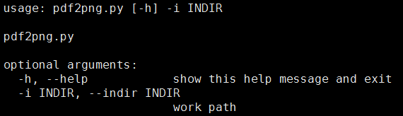
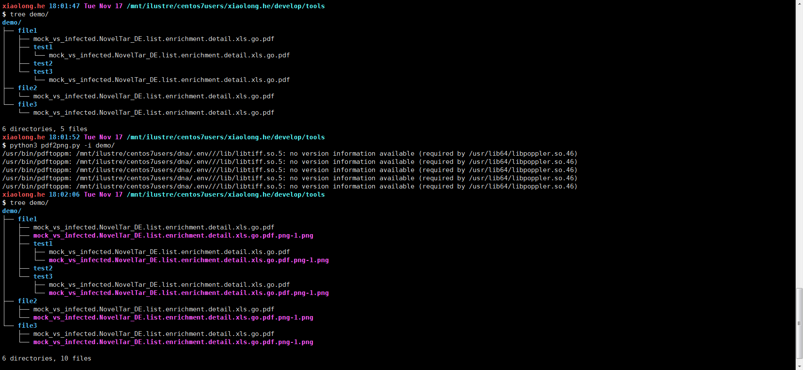

# Linux环境下，将PDF图片格式转成png图片格式


# pdf2png 
```linux
脚本路径：/mnt/ilustre/centos7users/xiaolong.he/develop/tools/pdf2png.py
```



# 用法示例

```linux
$ python3 pdf2png.py -i ./
```

# demo:



# 参考文献（参考工具连接）


