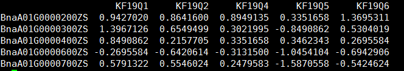
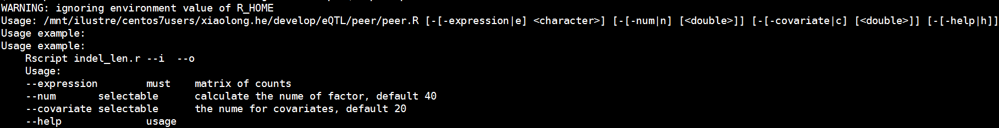
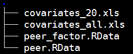
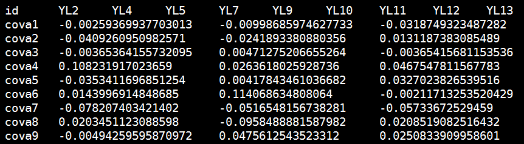
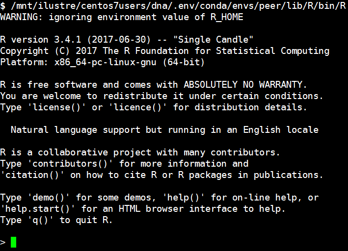

# Using probabilistic estimation of expression residuals (PEER) to obtain increased power and interpretability of gene expression analyses


# peer 

[官方帮助文档](https://github.com/PMBio/peer/wiki/Tutorial)

# 一、数据准备 

# 输入数据为表达量矩阵文件，其中行为基因，列为样本：



# 二、使用说明 

```r
脚本路径：/mnt/ilustre/centos7users/xiaolong.he/develop/eQTL/peer/peer.R
示例：
export R_LIBS=;export R_HOME=;export RHOME=;/mnt/ilustre/centos7users/dna/.env/conda/envs/peer/lib/R/bin/Rscript /mnt/ilustre/centos7users/xiaolong.he/develop/eQTL/peer/peer.R -e SDKF.txt -n 40 -c 20
```



### 参数详情 
```r
--expression	must	matrix of counts    输入表达矩阵文件
--num	selectable	calculate the nume of factor, default 40    计算因子数，默认40
--covariate	selectable	the nume for covariates, default 20    提取协变量数，默认20
```

### 代码 

```r
1 #!/usr/bin/env Rscript
2 suppressMessages(library("getopt"))
3 options(bitmapType='cairo')
4 spec = matrix(c(
5     'expression','e',1,'character',
6     'num','n',2,'numeric',
7     'covariate','c',2,'numeric',
8     'help','h',0,'logical'
9     ), byrow=TRUE, ncol=4);
10 opt = getopt(spec);
11 print_usage <- function(spec=NULL){
12   cat(getopt(spec, usage=TRUE));
13   cat("Usage example: \n");
14   cat("Usage example:
15     Rscript indel_len.r --i  --o
16     Usage:
17     --expression        must    matrix of counts
18     --num       selectable      calculate the nume of factor,default 40
19     --covariate selectable      the nume for covariates, default20
20     --help              usage\n"
21     );
22   q(status=1);
23 }
24 
25 if ( !is.null(opt$help)) {print_usage(spec)}
26 if ( is.null(opt$expression)){print_usage(spec)}
27 if ( is.null(opt$num)){opt$num = 40}
28 if ( is.null(opt$covariate)){opt$covariate = 20}
29 
30 suppressMessages(library("peer"))
31 
32 dat <- read.table(opt$expression, header=T,row.names=1,sep='\t'stringsAsFactors=F)
33 dat <- t(dat)
34 model = PEER()
35 PEER_setPhenoMean(model,as.matrix(dat))
36 PEER_setNk(model,opt$num)
37 PEER_getNk(model)
38 
39 # 此步骤较为耗时
40 PEER_update(model)
41 
42 factors = PEER_getX(model)

42 factors = PEER_getX(model)
43 
44 colname <- c("id",rownames(dat))
45 rowname <- paste("cova", 1:dim(factors)[2],sep="")
46 covariates <- data.frame(rowname, t(factors))
47 colnames(covariates) <- colname
48 
49 write.table(covariates,"covariates_all.xls",sep="\t",col.names=Trow.names=F,quote=F)
50 write.table(covariates[1:opt$covariate,],"covariates_20.xls"sep="\t", col.names=T,row.names=F,quote=F)
51 save.image("peer.RData")
52 proc.time()
```

# 三、结果展示 #

### 结果目录展示： ###


### covariates结果文件内容展示 ###


# 注意: #
脚本所用R为coda环境的版本，版本号为3.4，路径为`/mnt/ilustre/centos7users/dna/.env/conda/envs/peer/lib/R/bin/R`，使用时请参照示例。




# 参考文献
1. Stegle, O., Parts, L., Piipari, M. et al. [Using probabilistic estimation of expression residuals (PEER) to obtain increased power and interpretability of gene expression analyses](https://doi.org/10.1038/nprot.2011.457). Nat Protoc 7, 500–507 (2012). 

