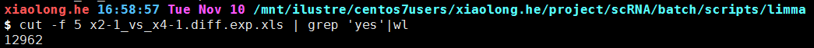
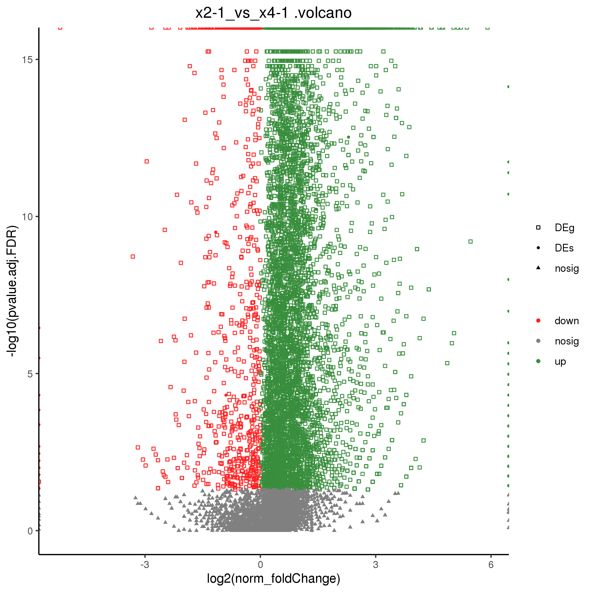
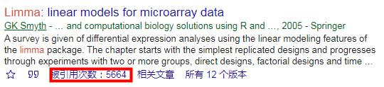
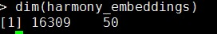
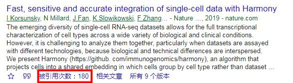
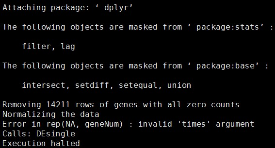
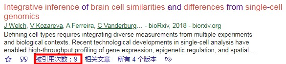
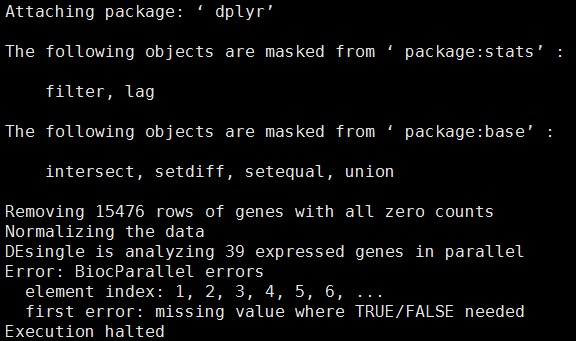
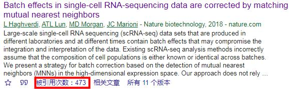

# 不同scRNAseq批次效应矫正方法计算比较


#  Batch methds #

所用数据:
```
/mnt/ilustre/centos7users/xiaolong.he/project/scRNA/new_pipe/04.Step4.combain/Merged.Seurat.rds
```
## limma ##

```r
#!/usr/bin/env Rscript3.6.1
suppressMessages(library("getopt"))
options(bitmapType='cairo')
spec = matrix(c(
    'rds','r',1,'character',
    'outdir','o',1,'character',
    'help','h',0,'logical'
    ), byrow=TRUE, ncol=4);
opt = getopt(spec);
print_usage <- function(spec=NULL){
  cat(getopt(spec, usage=TRUE));
  cat("Usage example: \n");
  cat("Usage example:
    Rscript limma.r --i  --o
    Usage:
    --rds       input file rds
    --outdir    outdir
    --help              usage\n"
    );
  q(status=1);
}

if ( !is.null(opt$help)) {print_usage(spec)}
if ( is.null(opt$rds)){print_usage(spec)}
if ( is.null(opt$outdir)){print_usage(spec)}


suppressMessages(library("Seurat"))

scRNA <- readRDS(opt$rds)
count <- as.matrix(scRNA@assays$RNA@counts)
count <- log(count+1)
batchs <- c(rep('1',7205),rep('2',9104))
lim_batch <- limma::removeBatchEffect(count,batch=batchs)
write.table(lim_batch,file=paste(opt$outdir,"limma.txt",sep=""),col.names=T,row.names=T,quote=F)
save.image(paste(opt$outdir,"limma.RData",sep=""))
proc.time()
```
limma去批次后矩阵含有大量负值，针对大量负值无法进行差异表达基因计算。
可通过对负值赋值为0后计算。




参考文献：Ritchie ME, Phipson B, Wu D, Hu Y, Law CW, Shi W and Smyth GK (2015). [limma powers differential expression analyses for RNA-sequencing and microarray studies](https://academic.oup.com/nar/article/43/7/e47/2414268). Nucleic Acids Research, 43, pp. doi: 10.1093/nar/gkv007



## harmony

```r
#!/usr/bin/env Rscript3.6.1
suppressMessages(library("getopt"))
options(bitmapType='cairo')
spec = matrix(c(
    'rds','r',1,'character',
    'outdir','o',1,'character',
    'help','h',0,'logical'
    ), byrow=TRUE, ncol=4);
opt = getopt(spec);
print_usage <- function(spec=NULL){
  cat(getopt(spec, usage=TRUE));
  cat("Usage example: \n");
  cat("Usage example:
    Rscript harmony.r --i  --o
    Usage:
    --rds       input file rds
    --outdir    outdir
    --help              usage\n"
    );
  q(status=1);
}

if ( !is.null(opt$help)) {print_usage(spec)}
if ( is.null(opt$rds)){print_usage(spec)}
if ( is.null(opt$outdir)){print_usage(spec)}

suppressMessages(c(library("harmony"),library("magrittr"),library("Seurat"),library("dplyr")))
scRNA <- readRDS(opt$rds)
# Normalize/find features
scRNA <- NormalizeData(scRNA)
scRNA <- FindVariableFeatures(scRNA, selection.method = "vst", nfeatures = 2000)
scRNA <- ScaleData(scRNA,vars.to.regress=c("nUMI", "percent.mito","percent.ribo","sample"))
scRNA <- RunPCA(scRNA, features = VariableFeatures(object = scRNA),verbose = F)
# batch
scRNA <- scRNA %>% RunHarmony("orig.ident", plot_convergence = TRUE)
paste(opt$outdir,"harmony.RData",sep="")
```


参考文献：Korsunsky I, Millard N, Fan J, et al. [Fast, sensitive and accurate integration of single-cell data with Harmony](https://www.nature.com/articles/s41592-019-0619-0). Nature methods, 2019: 1-8.



## LIGER ##
```r
#!/usr/bin/env Rscript3.6.1
suppressMessages(library("getopt"))
options(bitmapType='cairo')
spec = matrix(c(
    'rds','r',1,'character',
    'outdir','o',1,'character',
    'help','h',0,'logical'
    ), byrow=TRUE, ncol=4);
opt = getopt(spec);
print_usage <- function(spec=NULL){
  cat(getopt(spec, usage=TRUE));
  cat("Usage example: \n");
  cat("Usage example:
    Rscript liger.r --i  --o
    Usage:
    --rds	input file rds
    --outdir	outdir
    --help		usage\n"
    );
  q(status=1);
}

if ( !is.null(opt$help)) {print_usage(spec)}
if ( is.null(opt$rds)){print_usage(spec)}
if ( is.null(opt$outdir)){print_usage(spec)}

suppressMessages(c(library("liger"),library("Seurat")))

scRNA <- readRDS(opt$rds)
x2 <- scRNA@assays$RNA@counts[,1:7205]
x4 <- scRNA@assays$RNA@counts[,7206:16309]
ifnb_liger <- createLiger(list(x2 = x2, x4 = x4))
ifnb_liger <- normalize(ifnb_liger)
ifnb_liger <- selectGenes(ifnb_liger)
ifnb_liger <- scaleNotCenter(ifnb_liger)
ifnb_liger <- optimizeALS(ifnb_liger, k = 20)
ifnb_liger <- quantile_norm(ifnb_liger)
save.image(paste(opt$outdir,"LIGER_result.RData",sep=""))
proc.time()
```

使用liger去批次后所得矩阵，计算差异表达基因。由于liger去批次后数据矩阵结果0值过多，会导致计算差异表达时数据被删除的问题。



参考文献：Welch J, Kozareva V, Ferreira A, et al. Integrative inference of brain cell similarities and differences from single-cell genomics[J]. bioRxiv, 2018: 459891.



## MNN Correct ##
```r
#!/usr/bin/env Rscript3.6.1
suppressMessages(library("getopt"))
options(bitmapType='cairo')
spec = matrix(c(
    'rds','r',1,'character',
    'outdir','o',1,'character',
    'help','h',0,'logical'
    ), byrow=TRUE, ncol=4);
opt = getopt(spec);
print_usage <- function(spec=NULL){
  cat(getopt(spec, usage=TRUE));
  cat("Usage example: \n");
  cat("Usage example:
    Rscript mnncorrect.r --i  --o
    Usage:
    --rds       input file rds
    --outdir    outdir
    --help              usage\n"
    );
  q(status=1);
}

if ( !is.null(opt$help)) {print_usage(spec)}
if ( is.null(opt$rds)){print_usage(spec)}
if ( is.null(opt$outdir)){print_usage(spec)}


suppressMessages(c(library("Seurat"),library("batchelor")))

scRNA <- readRDS(opt$rds)
test1 <- scRNA@assays$RNA@counts[,1:7205]
test2 <- scRNA@assays$RNA@counts[,7206:16309]
test1 <- as.matrix(test1)
test2 <- as.matrix(test2)
out <- mnnCorrect(test1,test2)
save.image(paste(opt$outdir,"mnnCorrect.RData",sep=""))
proc.time()
```



参考文献：Haghverdi L, Lun A T L, Morgan M D, et al. Batch effects in single-cell RNA-sequencing data are corrected by matching mutual nearest neighbors[J]. Nature biotechnology, 2018, 36(5): 421-427.



## fastMNN ##
```r
#!/usr/bin/env Rscript3.6.1
suppressMessages(library("getopt"))
options(bitmapType='cairo')
spec = matrix(c(
    'rds','r',1,'character',
    'outdir','o',1,'character',
    'help','h',0,'logical'
    ), byrow=TRUE, ncol=4);
opt = getopt(spec);
print_usage <- function(spec=NULL){
  cat(getopt(spec, usage=TRUE));
  cat("Usage example: \n");
  cat("Usage example:
    Rscript fastmnn.r --i  --o
    Usage:
    --rds       input file rds
    --outdir    outdir
    --help              usage\n"
    );
  q(status=1);
}

if ( !is.null(opt$help)) {print_usage(spec)}
if ( is.null(opt$rds)){print_usage(spec)}
if ( is.null(opt$outdir)){print_usage(spec)}


suppressMessages(c(library("Seurat"),library("batchelor")))

scRNA <- readRDS(opt$rds)
test1 <- scRNA@assays$RNA@counts[,1:7205]
test2 <- scRNA@assays$RNA@counts[,7206:16309]
test1 <- as.matrix(test1)
test2 <- as.matrix(test2)
out <- fastMNN(test1,test2)
save.image(paste(opt$outdir,"mnnCorrect.RData",sep=""))
proc.time()
```

# 参考文献

Haghverdi L, Lun A T L, Morgan M D, et al. [Batch effects in single-cell RNA-sequencing data are corrected by matching mutual nearest neighbors](https://www.nature.com/articles/nbt.4091). Nature biotechnology, 2018, 36(5): 421-427.

Tran, H.T.N., Ang, K.S., Chevrier, M. et al. [A benchmark of batch-effect correction methods for single-cell RNA sequencing data](https://doi.org/10.1186/s13059-019-1850-9). Genome Biol 21, 12 (2020). 

