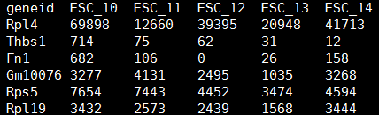
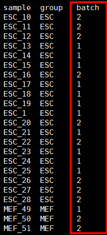
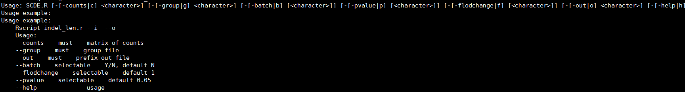
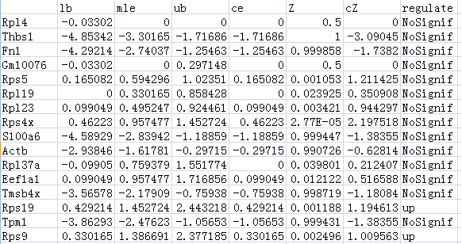
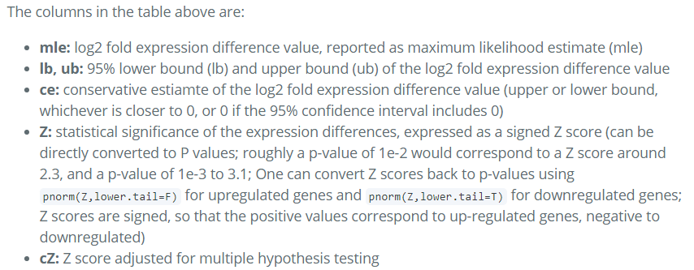
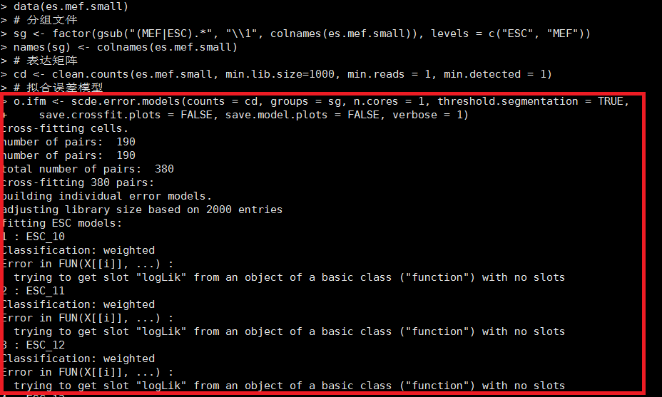

# Bayesian approach to single-cell differential expression analysis


# SCDE #

[SCDE官方帮助文档](https://github.com/hms-dbmi/scde/blob/master/vignettes/diffexp.md)
## 一. 数据准备 ##
1. 单细胞表达矩阵:行为基因，列为细胞
   


2. 分组文件（存在批次时，可添加批次信息进行批次处理）
   


## 二. Pipeline ##
```r
脚本位置：
/mnt/ilustre/centos7users/xiaolong.he/develop/scRNA/scripts/SCDE.R
用法示例：
Rscript SCDE.R -c matrix.xls -g group.xls -o test
```


## 三. 代码 ##

```r
#!/usr/bin/env Rscript
suppressMessages(library("getopt"))
options(bitmapType='cairo')
spec = matrix(c(
    'counts','c',1,'character',
    'group','g',1,'character',
    'batch','b',2,'character',
    'pvalue','p',2,'character',
    'flodchange','f',2,'character',
    'out','o',1,'character',
    'help','h',0,'logical'
    ), byrow=TRUE, ncol=4);
opt = getopt(spec);
print_usage <- function(spec=NULL){
  cat(getopt(spec, usage=TRUE));
  cat("Usage example: \n");
  cat("Usage example:
    Rscript indel_len.r --i  --o
    Usage:
    --counts    must    matrix of counts
    --group    must    group file
    --out    must    prefix out file
    --batch    selectable    Y/N, default N
    --flodchange    selectable    default 1
    --pvalue    selectable    default 0.05
    --help              usage\n"
    );
  q(status=1);
}

if ( !is.null(opt$help)) {print_usage(spec)}
if ( is.null(opt$counts)){print_usage(spec)}
if ( is.null(opt$group)){print_usage(spec)}
if ( is.null(opt$out)){print_usage(spec)}
if ( is.null(opt$pvalue)){opt$pvalue= 0.05}
if ( is.null(opt$flodchange)){opt$flodchange= 1}
if ( is.null(opt$batch)){opt$batch= 'N'}

.libPaths("/mnt/ilustre/centos7users/xiaolong.he/R/x86_64-pc-linux-gnu-library/3.5")
suppressMessages(library("scde"))

dat <- read.table(opt$counts,sep='\t',header=T,row.names=1,stringsAsFactor=F)
group <- read.table(opt$group,sep='\t',header=T,row.names=1,stringsAsFactor=F)
# group <- read.table(opt$group,sep=',',header=T,row.names=1,stringsAsFactor=F)
sg <- factor(group[,1])
# error model
o.ifm <- scde.error.models(counts = dat, groups = sg, n.cores = 1, threshold.segmentation = TRUE, 
    save.crossfit.plots = FALSE, save.model.plots = FALSE, verbose = 1)
valid.cells <- o.ifm$corr.a > 0
o.ifm <- o.ifm[valid.cells, ]

o.prior <- scde.expression.prior(models = o.ifm, counts = dat, length.out = 400, show.plot = FALSE)
# save.image('scde1.RData')
if(opt$batch == 'N'){
ediff <- scde.expression.difference(o.ifm, dat, o.prior, groups  =  sg, n.randomizations  =  100, 
    n.cores  =  1, verbose  =  1)
}else if(opt$batch == 'Y'){
batch <- as.factor(group[,2])
ediff.batch <- scde.expression.difference(o.ifm, dat, o.prior, groups = sg, batch = batch, 
    n.randomizations = 100, n.cores = 1, return.posteriors = TRUE, verbose = 1)
ediff <- ediff.batch$batch.adjusted
}
ediff$Z <- pnorm(ediff$Z,lower.tail=F)
ediff[which(abs(ediff$mle) < opt$flodchange | ediff$Z > opt$pvalue),'regulate'] <- "NoSignif"
ediff[which(ediff$mle <= -opt$flodchange & ediff$Z <= opt$pvalue), 'regulate'] <- "down"
ediff[which(ediff$mle >= opt$flodchange & ediff$Z <= opt$pvalue),'regulate'] <- "up"

write.table(ediff,paste(opt$out,'.diff.xls',sep=''),col.names=T,row.names=T,quote=F)
save.image('scde.RData')
proc.time()
```

## 结果说明 ##



## 注意 ##
scde依赖的flexmix包安装版本为2.3-13，新版本的flexmix会导致运行报错：
[官方说明](https://github.com/hms-dbmi/scde/issues/40)



# 参考文献

Kharchenko, P., Silberstein, L. & Scadden, D. [Bayesian approach to single-cell differential expression analysis](https://doi.org/10.1038/nmeth.2967). Nat Methods 11, 740–742 (2014).


