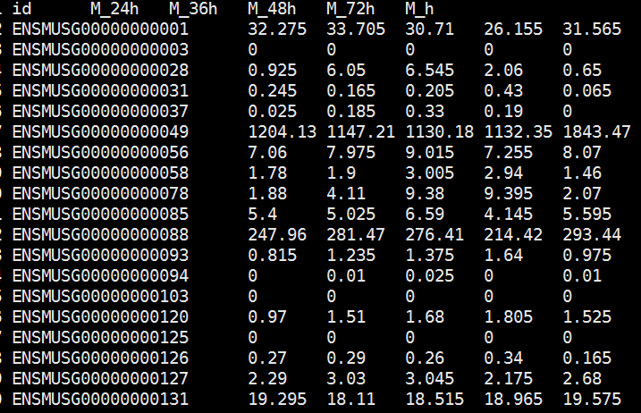
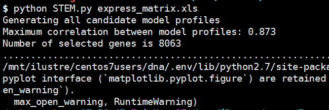
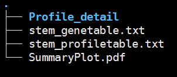

# The Short Time-series Expression Miner


# STEM: a tool for the analysis of short time series gene expression data #

[STEM官方帮助文档](http://www.sb.cs.cmu.edu/stem)

## 一. 数据准备 ##
1. RNseq 表达矩阵文件:行为基因，列为样本
   


## 二. Pipeline ##
```python
脚本位置：
/mnt/ilustre/centos7users/daokuan.zhang/workspace/develop/STEM/STEM.py

用法示例：
python /mnt/ilustre/centos7users/daokuan.zhang/workspace/develop/STEM/STEM.py matrix.txt
```


## 三. 代码 ##
```python
#!/usr/bin/env python
# -*- coding: utf-8 -*-
#Author daokuan.zhang
#Usage: python STEM.py express_matrix.txt

import os,sys
import seaborn as sns
import pandas as pd
import matplotlib.pyplot as plt
import subprocess
from shutil import copyfile

def custom_plot(x, y, **kwargs):
    ax = plt.gca()
    data = kwargs.pop('data')
    profile = kwargs.pop('profile')
    colordict = kwargs.pop('colordict')
    pid = data['Profile ID'].tolist()[0]
    row = profile.loc[pid]
    cluster = row['Cluster (-1 non-significant)']
    color = colordict.get(cluster)
    ax.patch.set_fc(color)
    pvalue = row['p-value']
    ax.annotate(s='pvalue:%.2g' % pvalue, xy=(0.5, 0.95), xycoords='axes fraction')
    genes = row['# %ss Assigned' % term]
    ax.annotate(s='%ss: %d' % (term, genes), xy=(0.05, 0.05), xycoords='axes fraction')
    data.plot(x=x, y=y, ax=ax, grid=False, **kwargs)
def plothline(x, y, **kwargs):
    plt.axhline(y=0, alpha=0.5, color='k', lw=0.1)

def profileoutput():
    creat = "all"
    sigprofile = profile[
        profile['p-value'] <= 0.05] if creat == 'significant' else profile
    sigprofile = sigprofile.sort_values('p-value')
    for i2, (profileid, prow) in enumerate(sigprofile.iterrows(), 1):
        name2 = '%d_Profile_%d' % (i2, profileid)
        try:
            gd = group.get_group(str(profileid))
        except KeyError:
            try:
                gd = group.get_group(profileid)
            except KeyError:
                continue
        if gd.empty:
            continue
        gd = gd.ix[:, 2:]
        fig, ax = plt.subplots()
        plt.axhline(y=0, c='k', lw=1, alpha=0.5)
        gdt = gd.T
        gdt.plot(colormap='Set2', legend=False, lw=1, ax=ax, alpha=0.5, xticks=range(len(gdt)))
        model = [float(n) for n in prow['Profile Model'].split(',')]
        ax.plot(range(gdt.shape[0]), model, lw=2, c='g', alpha=0.8)
        ylabel = 'Expression Change(log2(v(i)/v(0))'
        plt.ylabel(ylabel)
        plt.xlabel('Times')
        plt.title('Profile Model:(%s)\n%d %ss Assigned; %d %ss Expected; p-value=%.2g'
                  % (prow['Profile Model'], prow['# %ss Assigned' % term], term,
                     prow['# %s Expected' % term], term, prow['p-value']))
        ax.spines['left'].set_position(('data', 0))
        gd.columns += ".%s" % ylabel
        pdfname= name2+".pdf"
        plt.savefig(pdfname)
        gd.to_csv(name2 + '.xls', index_label='id', sep='\t')

stembin="/mnt/ilustre/centos7users/daokuan.zhang/workspace/develop/softwareKits/STEM/stem.jar"
conf="/mnt/ilustre/centos7users/daokuan.zhang/workspace/develop/softwareKits/STEM/config.txt"
if not os.path.exists("stem_out"):
    os.makedirs("stem_out")
copyfile(sys.argv[1],"stem_matrix.xls")
copyfile(conf,"stem.txt")
subprocess.check_call('java -mx1024M -jar "%s" -b stem.txt stem_out' % (stembin),shell=True)
data = pd.read_csv("stem_out/stem_genetable.txt",index_col=0,sep="\t")
profile = pd.read_csv("stem_out/stem_profiletable.txt",index_col=0,sep="\t")
matrix = pd.read_csv("stem_matrix.xls",index_col=0,header=0,sep="\t")
os.chdir("stem_out")
gene_map = {str(n).upper(): n for n in matrix.index}
data.index = [gene_map.get(n) for n in data.index]
group = data.groupby(by='Profile')
data = data.iloc[:, 2:].astype(float)
profile.sort_values('p-value', inplace=True)
model = profile['Profile Model'].str.split(',', expand=True)
model.columns = data.columns
model = model.astype(float).astype(int)
model.columns.set_names('time', inplace=True)
cluster = profile['Cluster (-1 non-significant)'].unique()
ncolors = sns.color_palette('pastel', n_colors=len(cluster) - 1)
ncolors.append('#BEBEBE')
colordict = dict(zip(cluster, ncolors))
model_stack = model.stack().reset_index(name='model')
term="Gene"
grid = sns.FacetGrid(data=model_stack, col_wrap=8, col='Profile ID',col_order=profile.index)
grid.map_dataframe(custom_plot, 'time', 'model', lw=1, profile=profile, colordict=colordict)
grid.map(plothline, 'time', 'model')
grid.savefig('SummaryPlot.pdf')
profileoutput()
```

## 结果说明 ##

```python
- stem_profiletable.txt：各profile 在不同时间点变化趋势值文件
- stem_genetable.txt：各基因所属的profile以及cluster编号信息文件
- SummaryPlot.pdf: 所有profile的趋势图
- Profile_detail： 每个profile的基因变化趋势结果文件夹
```
## 注意 ##
如有生物学重复，使用均值进行时序分析
# 参考文献
Ernst, J., Bar-Joseph, Z. [STEM: a tool for the analysis of short time series gene expression data](https://doi.org/10.1186/1471-2105-7-191). BMC Bioinformatics 7, 191 (2006). 
